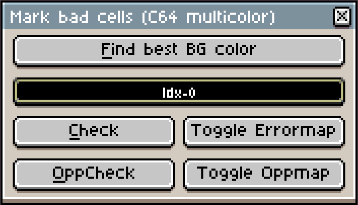

# C64 image format helper scripts for [Aseprite](https://www.aseprite.org/)

## Installing

>You need to run at least Aseprite v1.2.10 (beta at the time of writing) with lua scripting support.

Click on `File/Scripts/Open script folder` and copy the files from this repo there (well actually the lua and prg files are enough). Restart Aseprite, and the new commands should show up in the `File/Scripts` menu.

> Tip: You can assign keyboard shortcuts to scripts in the `Edit/Keyboard shorcuts` menu

## Getting started
The multicolor bitmap mode on the C64 is 160x200 (with double wide pixels) resolution image, where each "attribute cell" is 4x8 pixels, and can contain maximum of four colors: 3 can be unique in every cell, and one common color (the "background color").

The simplest way to start is to duplicate the included aseprite image, and use that, it is set up the way as the scripts expect it.

But if you want to do it manually:

In the "New Sprite" dialog, set:
* Resoltion: 160x200
* Color mode: Indexed
* Open the `Advanced options` section, set the `Pixel aspect ratio` to `Double-wide Pixels 2:1`
* Palette: `Presets` (above the palette), and load the C64 palette from there.
* The scripts work with a couple of extra colors for the markings outside of the 16 color C64 palette. Add the following colors:
  * index 16 (purple) - not actually used by the scripts, I use it as a transparent color.
  * index 17 (bright red) - this will mark cells with errors
  * index 18 (orange) - cells with one more possible color
  * index 19 (blue) - cells with two more possible colors
  * index 20 (green) - cells with three more possible colors

>Tip: set the grid dimension to 4x8 in the `View/Grid/Grid settings` menu. 

## C64 multicolor check

### Find best BG color
Brute force search for the color which produces the least errors in the image.
### Color field
The currently used background color. The previous option will find the best one, but can be set manually.
### Check
Check the image for errors.
It will create a new layer called "Error map", and fills every attribute cells with the color index 18 (red if you use the included starter image) which contains more than 3 colors + bg color.
### Toggle error map
Handy shortcut to toggle the visibility of the error map.
### OppCheck
Checks the image for "opportunities" - attribute cells with less colors then allowed - i.e. Where can I put more colors?
It will create a new layer called "Oppmap" and color codes the cells - marks cells with one color with index 20 (green), cells with two colors with index 19 (blue), and cells with 3 colors and no background color with index 18 (orange).
### Toggle Oppmap
Toggles the visibility of the opportunity map on and off.

## Export Koala

### Save as
The filename to save the koala/prg file, without extension. By default it is the same as the currently open asperite file name, but you can modify it by hand.
Unfortunately it seems that there are no file picker accessible from the scripts yet. :(
### Load at $6000
Specify the load address of the koala file.
### BG Color
Which color index to use as the background color?
### Koala/PRG radio buttons
Choose the file format:
* Koala will export the image as pure data .kla file, starting at the memory address 0x6000
* PRG will use the file "koalaview.prg" in the scripts directory, and appends the koala binary to that. The program is runnable on a C64, and simply displays the appended koala image.
